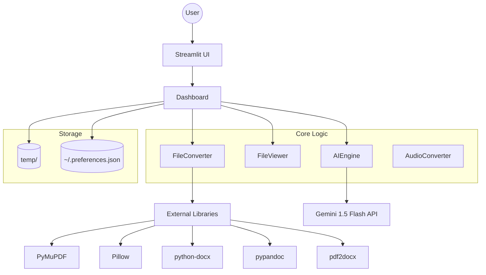

# System Architecture — Universal File Workstation

## Key Modules
1. **`main.py`**: Entry point, session state, and layout orchestration.
2. **`core/converter.py`**: Business logic for format transformations.
3. **`core/viewer.py`**: Rendering and preview logic for UI.
4. **`core/ai_engine.py`**: LLM integration and prompt management.
5. **`ui/dashboard.py`**: Streamlit layout and user interaction components.
